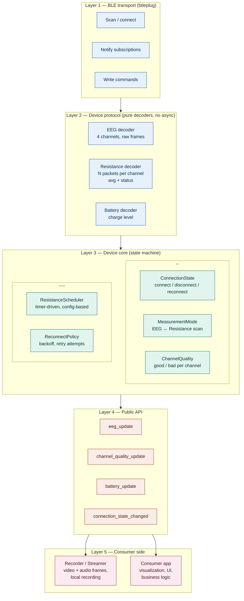

# BrainBit library — layered architecture

## Layer responsibilities

- **BLE transport** — thin wrapper over `btleplug::Peripheral`: scanning, connect/disconnect, notify subscriptions, writing commands. No business logic; surfaces raw connection drop events.

- **Device protocol** — pure `&[u8] -> DomainType` functions, no `async`, no state. Easy to unit-test against fixtures without any BLE involved.

- **Device core** — the state machine: connection state, EEG ↔ resistance-scan mode switching (driven internally by a timer/config), per-channel quality tracking, reconnect policy.

- **Public API** — the `EventHandler` trait (via `async_trait`) is the single point of outward-facing events: EEG data, channel quality, battery level, connection state changes.

- **Consumer side** — anything implementing `EventHandler`: a `Recorder`/`Streamer` pushing frames to disk or RTMP, or the actual application with visualization and UI logic.
